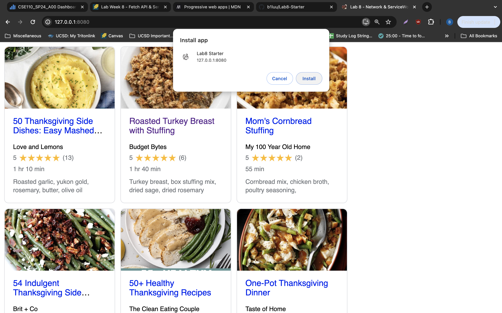

# Lab8-Starter

https://github.com/b1luu/Lab8-Starter

Graceful degradation and service workers are related in the context of web development as both aim to improve user experience under varying conditions. Graceful degradation ensures that an application remains functional even when some advanced features are not supported or fail to work. Service workers enhance this principle by enabling web applications to work offline and handle network interruptions, allowing web applications to continue operating smoothly even when the network is unreliable or unavailable.

